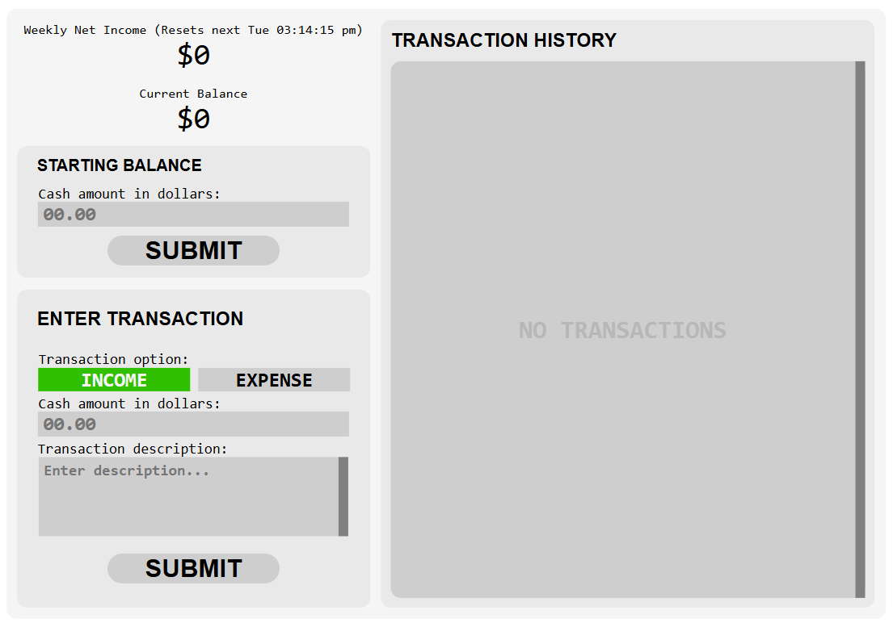
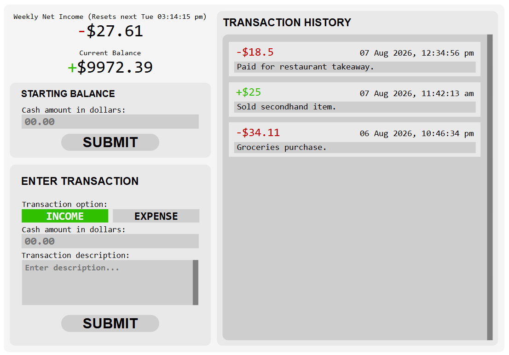

# Full Stack Personal Finance Ledger App

A full stack desktop web app built using React, FastAPI and SQLite3 for manually tracking personal income and expenses, current balance and net income on a weekly basis.

### Live Deployment On Render (Platform as a Service) 

The frontend user interface and backend API service for this app are hosted live on Render for direct access without the need for building locally.

Render links for user interface and API service is provided below:
- **Static site for the user interface**: https://finance-tracker-ui-syk4.onrender.com/
- **Web service for API**: https://finance-tracker-fastapi-1j8h.onrender.com/

***Important Note: This app is hosted using Render's free tier. Web service for API may take up to around 30 seconds or more to start up for full app functionality, which will be indicated when server status turns from red to green.***

Instructions on how to use the app is provided under [Usage](#usage) starting from step 2.

### Table Of Contents
1. [Requirements](#requirements)
2. [Installation and Setup](#installation-and-setup)
3. [Usage](#usage)
4. [Technical Details](#technical-details)
    - [FastAPI Endpoints](#fastapi-endpoints)
    - [SQLite3 Database Tables](#sqlite3-database-tables)
    - [React Frontend](#react-frontend)

## Requirements

### Runtimes

- **Node.js** *(v25.9.0 or higher)*: Runtime for frontend stack.
- **Python** *(v3.11.0 or higher)*: Runtime for backend stack.

### Frontend Stack (React)

- **React (JavaScript)**: JavaScript library for building web based user interfaces using JSX components (Javascript combined with HTML).
- **Vite**: Build tool for local development of the React frontend.

### Backend Stack (FastAPI/SQLite3)

- **FastAPI**: Python web framework for building API endpoints.
- **Uvicorn**: ASGI web server for hosting FastAPI.
- **SQLite3**: Database engine for working with SQL tables locally.
- **Pydantic**: Python library used for data validation of HTTP requests received from React frontend.

## Installation and Setup

#### 1. Open terminal in project directory and install Python libraries and start FastAPI:

For Windows OS 11:
```powershell
cd backend
python -m venv venv
.\venv\Scripts\activate
pip install -r requirements.txt
fastapi run main.py
```

For Linux and Mac OS:
```bash
cd backend
python -m venv venv
./venv/Scripts/activate
pip install -r requirements.txt
fastapi run main.py
```

#### 2. Open a second terminal in project directory to install all packages and build React production preview:
For Windows 11, Linux and Mac OS:
```
cd frontend
npm install
npm audit fix
npm run build
npm run preview
```

## Usage

The following image illustrates the app UI on startup. (Instructions on usage will be reliant on this image.)  



1. Navigate to http://localhost:4173 using a web browser (e.g. Google Chrome, Edge, Firefox) to display the UI.
2. Enter starting balance using the **STARTING BALANCE** widget when using the app for the first time. This amount will be displayed under *Current Balance* as shown in the image above. 
3. Use the **ENTER TRANSACTION** widget to manually record any income and expenses. Net income and current balance is updated every time new transactions are added. Previous transactions and their details are displayed in **TRANSACTION HISTORY**.

(App after submitting a few example transactions.)


## Technical Details
### FastAPI Endpoints

FastAPI is used to expose API endpoints for the frontend to interact with local SQL database and JSON configuration files. All API endpoints are listed below with their name, HTTP method and purpose:

| API Endpoint | Method | Purpose |
| --- | --- | --- |
| /cash-amounts | POST | Record the current net income and current balance to amount_history_table. |
| /current-cash-amounts | PUT | Save the current net income and current balance to JSON configuration file. |
| /current-cash-amounts | GET | Get the current net income and current balance from JSON configuration file on app startup or refresh. |
| /transaction-entries | POST | Add transaction entry to transaction_table and return new entry ID. |
| /transaction-entries | GET | Get transaction entries from transaction_table to display in history on frontend. |
| /utc-epoch-timestamp | PUT | Save the current timestamp in epoch seconds to JSON configuration file.
| /utc-epoch-timestamp | GET | Get the timestamp recorded in JSON configuration file.

### SQLite3 Database Tables

- This app uses two SQL tables to record the current balance, net income and transactions as they're submitted by user.
    - `amount_history_table` records the current balance and net income periodically. (New entry added every week by default.)
    - `transaction_table` records every transaction submitted by user and used for displaying transaction history on frontend.
- Cash amount are saved as cents to prevent floating point rounding errors.
- Details for `amount_history_table` and `transaction_table` are provided below. 

#### amount_history_table
| Field name | Type | Description |
| --- | --- | --- |
| entry_id | INTEGER | Unique ID for entries. (automatically generated during insertion) |
| entry_datetime | TEXT | Date and time of when entry was added. |
| net_income_cents | INTEGER | Net income recorded at date and time. |
| current_balance_cents | INTEGER | Current balance recorded at date and time. |

#### transaction_table
| Field name | Type | Description |
| --- | --- | --- |
| entry_id | INTEGER | Unique ID for entries. (automatically generated during insertion) |
| entry_datetime | TEXT | Date and time of when entry was added. |
| transaction_type | VARCHAR(7) | Indicates if cash is earned or loss. (either "income" or "expense") |
| transaction_desc | TEXT | Text description entered by user. |
| amount_cents | INTEGER | Transaction cash amount in cents. |

### React Frontend

The frontend relies on HTTP requests to perform essential tasks which include but not limited to setting the starting balance, entering new transactions and retrieving the transaction history. Details on these processes are provided below in dotpoints.

- Setting the starting balance when using app for the first time.
    - Sends a **PUT** request to **/current-cash-amounts** endpoint containing the starting balance amount submitted by user to update the JSON configuration file on backend.
- Entering a new transaction from frontend to SQL database on backend.
    - Sends a **POST** request to **/transaction-entries** endpoint containing transaction details entered by user.
    - New transaction entry containing submitted information is added to `transaction_table` on backend.
    - Frontend receives the new entry ID from backend via HTTP response and transaction is added to **TRANSACTION HISTORY**.
- Retrieving transaction history from SQL database on frontend startup or refresh.
    - On app startup/refresh, send a **GET** request to **/transaction-entries** along with **n_entries=N** argument to select the N latest transaction entries from `transaction_table`.
    - Frontend receives transactions as JS objects and displays them in **TRANSACTION HISTORY**.