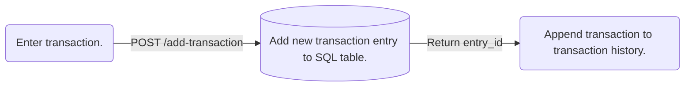

# Full Stack Personal Finance Tracker/Ledger

This project is a first attempt a building a full stack localised app using React, FastAPI and SQLite3 for manually tracking personal income and expense transactions, along with the current balance and weekly net income are also displayed.

### Table Of Contents
1. Requirements
2. Installation and Setup
3. Usage
4. Technical Details
    - React Frontend
    - FastAPI/SQLite3 Backend

## Requirements

### Runtimes

- **Node.js** *(v25.9.0 or higher)*: Runtime for frontend stack.
- **Python** *(v3.11.0 or higher)*: Runtime for backend stack.

### Frontend Stack (React)

- **React (JavaScript)**: JavaScript library for building component based and interactive user interfaces.
- **Vite**: Build tool and local development server for React frontend.

### Backend Stack (FastAPI/SQLite3)

- **FastAPI**: High performance web framework for building APIs in Python.
- **Uvicorn**: Production level ASGI web server implementation for hosting FastAPI servers.
- **SQLite3**: Serverless SQL database engine for working with SQL tables locally.
- **Pydantic**: Python library used for data validation during FastAPI HTTP requests from React frontend.

## Installation and Setup

#### 1. Open terminal in project directory and install Python libraries and start FastAPI server:

For Windows OS 11:
```powershell
cd backend
python -m venv venv
.\venv\Scripts\activate
pip install -r requirements.txt
fastapi run main.py
```

For Linux and Mac OS:
```bash
cd backend
python -m venv venv
./venv/Scripts/activate
pip install -r requirements.txt
fastapi run main.py
```

#### 2. Open a second terminal in project directory to install all packages and build React production preview:
For Windows 11, Linux and Mac OS:
```
cd frontend
npm install
npm run build
npm run preview
```

## Usage

1. Navigate to http://localhost:4173 using a web browser (e.g. Google Chrome, Edge, Firefox) to display the UI. 
2. Enter starting balance using the **STARTING BALANCE** widget when using the app for the first time. This amount will be displayed under *Current Balance*. 
3. Use the **ENTER TRANSACTION** widget to manually record any income and expenses. Net income and current balance is updated every time new transactions are added. Previous transactions and their details are displayed in the **TRANSACTION HISTORY** widget.

## Technical Details
### FastAPI/SQLite3 Backend
### React Frontend

- Entering a new transaction from frontend to SQL database on backend.

