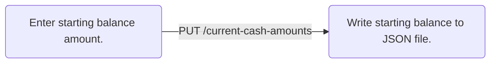
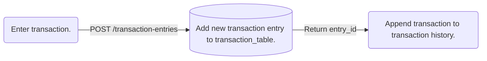
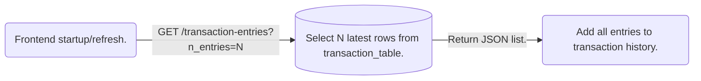

# Full Stack Personal Finance Ledger App

This project is a full stack local app using React, FastAPI and SQLite3 for manually tracking personal income and expenses, current balance and weekly net income. It has also served as a project to gain fundamental experience in working with full stack technologies and learning how frontend and backend services communicate and transfer data via HTTP requests and APIs.

### Table Of Contents
1. [Requirements](#requirements)
2. [Installation and Setup](#installation-and-setup)
3. [Usage](#usage)
4. [Technical Details](#technical-details)
    - [FastAPI Backend Database (SQLite3)](#fastapi-backend-database-sqlite3)
    - [React Frontend](#react-frontend)

## Requirements

### Runtimes

- **Node.js** *(v25.9.0 or higher)*: Runtime for frontend stack.
- **Python** *(v3.11.0 or higher)*: Runtime for backend stack.

### Frontend Stack (React)

- **React (JavaScript)**: JavaScript library for building component based and interactive user interfaces.
- **Vite**: Build tool and local development server for React frontend.

### Backend Stack (FastAPI/SQLite3)

- **FastAPI**: High performance web framework for building APIs in Python.
- **Uvicorn**: Production level ASGI web server for hosting FastAPI.
- **SQLite3**: Serverless SQL database engine for working with SQL tables locally.
- **Pydantic**: Python library used for data validation during FastAPI HTTP requests from React frontend.

## Installation and Setup

#### 1. Open terminal in project directory and install Python libraries and start FastAPI:

For Windows OS 11:
```powershell
cd backend
python -m venv venv
.\venv\Scripts\activate
pip install -r requirements.txt
fastapi run main.py
```

For Linux and Mac OS:
```bash
cd backend
python -m venv venv
./venv/Scripts/activate
pip install -r requirements.txt
fastapi run main.py
```

#### 2. Open a second terminal in project directory to install all packages and build React production preview:
For Windows 11, Linux and Mac OS:
```
cd frontend
npm install
npm run build
npm run preview
```

## Usage

The following image illustrates the app UI on startup. (Instructions on usage will be reliant on this image.)  


1. Navigate to http://localhost:4173 using a web browser (e.g. Google Chrome, Edge, Firefox) to display the UI.
2. Enter starting balance using the **STARTING BALANCE** widget when using the app for the first time. This amount will be displayed under *Current Balance* as shown in the image above. 
3. Use the **ENTER TRANSACTION** widget to manually record any income and expenses. Net income and current balance is updated every time new transactions are added. Previous transactions and their details are displayed in **TRANSACTION HISTORY**.

## Technical Details
### FastAPI Backend Database (SQLite3)

- This app uses two SQL tables to record the current balance, net income and transactions as they're submitted by user.
    - `amount_history_table` records the current balance and net income periodically. (New entry added every week by default.)
    - `transaction_table` records every transaction submitted by user and used for displaying transaction history on frontend.
- Cash amount are saved as cents to prevent floating point rounding errors.
- Details for `amount_history_table` and `transaction_table` are provided below. 

#### amount_history_table
| Field name | Type | Description |
| --- | --- | --- |
| entry_id | INTEGER | Unique ID for entries. (automatically generated during insertion) |
| entry_datetime | TEXT | Date and time of when entry was added. |
| net_income_cents | INTEGER | Net income recorded at date and time. |
| current_balance_cents | INTEGER | Current balance recorded at date and time. |

#### transaction_table
| Field name | Type | Description |
| --- | --- | --- |
| entry_id | INTEGER | Unique ID for entries. (automatically generated during insertion) |
| entry_datetime | TEXT | Date and time of when entry was added. |
| transaction_type | VARCHAR(7) | Indicates if cash is earned or loss. (either "income" or "expense") |
| transaction_desc | TEXT | Text description entered by user. |
| amount_cents | INTEGER | Transaction cash amount in cents. |

### React Frontend

The frontend relies on HTTP requests to perform essential tasks which include but not limited to setting the starting balance, entering new transactions and retrieving the transaction history. Below are flowcharts illustrating these three processes the frontend relies on for basic functionality.

#### Setting the starting balance when using app for the first time.


#### Entering a new transaction from frontend to SQL database on backend.


#### Retrieving transaction history from SQL database on frontend startup or refresh.
